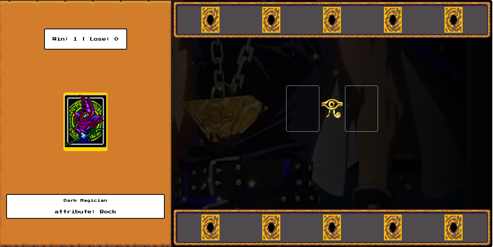

# 🃏 Yu-Gi-Oh Jo-Ken-Po

Recriação de um mini-game inspirado no **universo Yu-Gi-Oh**, utilizando as mecânicas clássicas do **Jo-Ken-Po (Pedra, Papel e Tesoura)**.

---

## 🖼️ **Screenshot**



---

## 🎮 **Sobre o projeto**

Neste projeto recriamos um jogo do Yu-Gi-Oh com a seguinte proposta:

- Utilizar as **mecânicas de Jo-Ken-Po** para as batalhas.
- Praticar **organização avançada de states** com **Java-script**.
- Estruturar arquivos de forma limpa e escalável.
- Criar **funções reaproveitáveis** para qualquer projeto JS futuro.
- Incrementado **Responsivo**

---

## 🛠️ **Tecnologias utilizadas**

- HTML5
- CSS
- JavaScript
- Manipulção de DOM


---

## 📁 **Funcionalidades**

✅ Seleção de cartas (dragões, magos e exodia)  
✅ Lógica de vitória/derrota baseada em Jo-Ken-Po  
✅ Atualização dinâmica de estado do jogo  
✅ Organização modular de funções e arquivos  
✅ Responsivo para diversas telas

---

## 🚀 **Como executar**

1. Clone o repositório:

```bash
git clone https://github.com/SEU_USUARIO/SEU_REPOSITORIO.git
